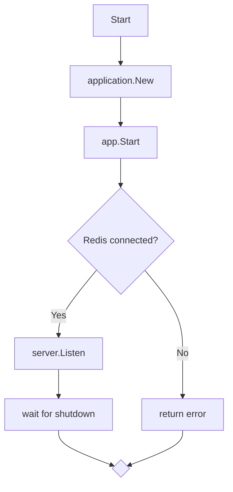

```mermaid
flowchart TD
    A[Start] --> B[application.New]
    B --> C[app.Start]
    C --> D{Redis connected?}

    D -->|Yes| E[server.Listen]
    E --> F[wait for shutdown]
    F --> G{ }

    D -->|No| H[return error]
    H --> G
```

